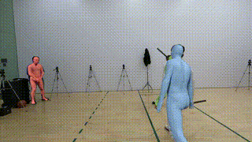
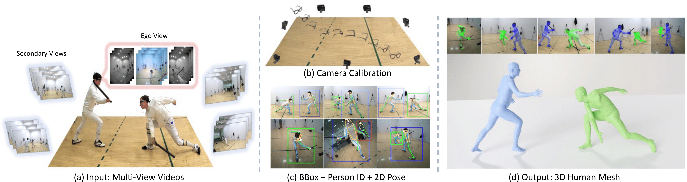

<div align="center">

<h2><a href="https://arxiv.org/pdf/2305.16487.pdf" style="color:#2ecc71;">EgoHumans: An Egocentric 3D Multi-Human Benchmark</a></h2>

<b><font size="4">ICCV 2023 (Oral)</font></b>

[Rawal Khirodkar](https://github.com/rawalkhirodkar)<sup>1</sup>, [Aayush Bansal](https://www.aayushbansal.xyz/)<sup>2</sup>, [Lingni Ma](https://scholar.google.nl/citations?user=eUAgpwkAAAAJ&hl=en/)<sup>2</sup>, [Richard Newcombe](https://scholar.google.co.uk/citations?user=MhowvPkAAAAJ&hl=en)<sup>2</sup>, [Minh Vo](https://minhpvo.github.io/)<sup>2</sup>, [Kris Kitani](https://kriskitani.github.io/)<sup>1</sup>
 
<sup>1</sup>[CMU](https://www.cmu.edu/), <sup>2</sup>[Meta](https://about.meta.com/)

<p><a href="https://rawalkhirodkar.github.io/egohumans/" style="background-color:#2ecc71; color:white; padding:10px; text-decoration:none; border-radius:5px;">Project Page</a></p>


</div>


We present EgoHumans, a new multi-view multi-human
video benchmark to advance the state-of-the-art of egocentric human 3D pose estimation and tracking. Existing egocentric benchmarks either capture single subject or indooronly scenarios, which limit the generalization of computer
vision algorithms for real-world applications. We propose
a novel 3D capture setup to construct a comprehensive egocentric multi-human benchmark in the wild with annotations
to support diverse tasks such as human detection, tracking,
2D/3D pose estimation, and mesh recovery. We leverage
consumer-grade wearable camera-equipped glasses for the
egocentric view, which enables us to capture dynamic activities like playing tennis, fencing, volleyball, etc. Furthermore,
our multi-view setup generates accurate 3D ground truth
even under severe or complete occlusion. The dataset consists of more than 125k egocentric images, spanning diverse
scenes with a particular focus on challenging and unchoreographed multi-human activities and fast-moving egocentric
views. We rigorously evaluate existing state-of-the-art methods and highlight their limitations in the egocentric scenario,
specifically on multi-human tracking. To address such limitations, we propose EgoFormer, a novel approach with a
multi-stream transformer architecture and explicit 3D spatial
reasoning to estimate and track the human pose. EgoFormer
significantly outperforms prior art by 13.6% IDF1 on the
EgoHumans dataset


## Overview

<div style="text-align:center;">
    
</div>





## Get Started
- [🛠️Installation](assets/INSTALL.md)
- [📘Download Data](assets/DOWNLOAD.md)
- [👀Visualization](assets/VISUALIZE.md)
- [💻Data Process](assets/DATA_PROCESS.md)


## Supported Benchmarks
- [📦Bounding Box Detection](assets/DETECTION.md)
- [🕺2D Pose Estimation](assets/POSE2D.md)
- [🛤️Tracking](assets/TRACKING.md): Official benchmark from main paper.

## Create your own Benchmark
- [📷Image Tasks](assets/COCO_IMAGE.md)
- [📹Video Tasks](assets/COCO_VIDEO.md)

## BibTeX & Citation

```
@article{khirodkar2023egohumans,
  title={EgoHumans: An Egocentric 3D Multi-Human Benchmark},
  author={Khirodkar, Rawal and Bansal, Aayush and Ma, Lingni and Newcombe, Richard and Vo, Minh and Kitani, Kris},
  journal={arXiv preprint arXiv:2305.16487},
  year={2023}
}
```

## Acknowledgement
[Aria Toolkit](https://github.com/facebookresearch/projectaria_tools), [COLMAP](https://github.com/colmap/colmap), [mmpose](https://github.com/open-mmlab/mmpose/tree/main), [mmhuman3D](https://github.com/open-mmlab/mmhuman3d), [CLIFF](https://github.com/haofanwang/CLIFF), [timm](https://github.com/rwightman/pytorch-image-models), [detectron2](https://github.com/facebookresearch/detectron2), [mmcv](https://github.com/open-mmlab/mmcv), [mmdet](https://github.com/open-mmlab/mmdetection), [mmtrack](https://github.com/open-mmlab/mmtracking).


## Contact

- For help and issues associated with EgoHumans, or reporting a bug, please open a [GitHub Issue](https://github.com/rawalkhirodkar/egohumans).
- Please contact [Rawal Khirodkar](https://rawalkhirodkar.github.io/) (`rawalk@meta.com`) for any queries.

