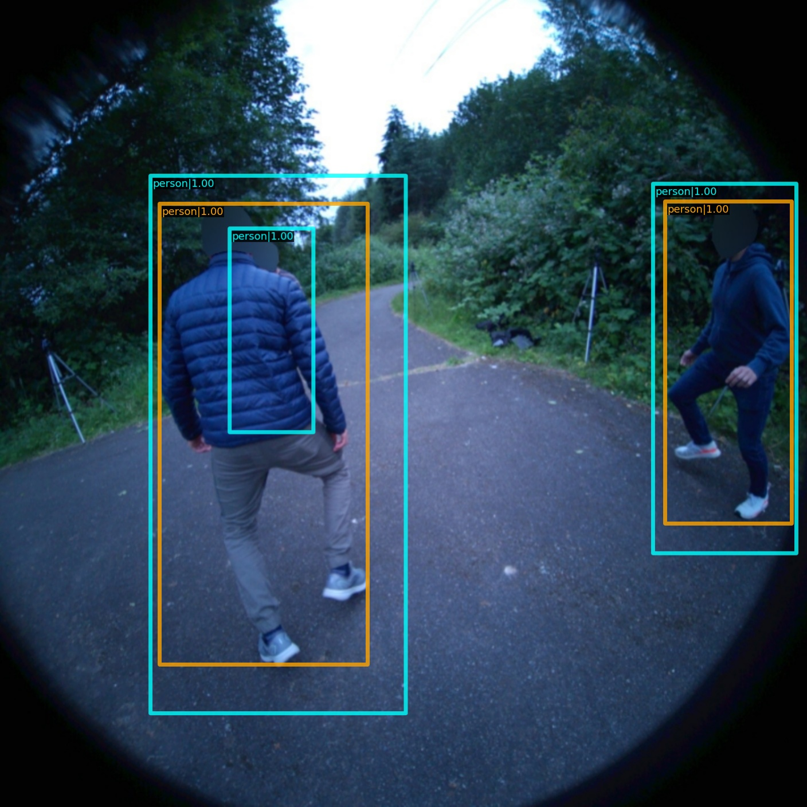

# Detection (Bounding-Box)

We provide evaluation scripts to test offshelf detection methods on the EgoHumans test set.
You can pick your favorite detector from the mmdetection model zoo and evaluate either on ```rgb-ego```, ```slam-ego``` (grayscale stereo) or ```rgb-exo``` images.


## Testing Detectors

- Please refer to the test script under ```./scripts/benchmarks/detection/0_test_bbox.sh```
- Modify the variables ```$CONFIG_FILE``` and ```$CHECKPOINT``` to select a detector. Refer to the [model zoo](https://github.com/rawalkhirodkar/egohumans/tree/main/egohumans/external/mmdetection/configs/faster_rcnn) for supported methods.
- Modify the variable ```$SEQUENCE_ROOT_DIR``` to point to the absolute path to the data.
- Modify the variable ```$SAVE_BIG_SEQUENCE_NAME``` to select the combination of big sequences used for evaluations.
- Modify the variable ```$MODE``` to be either ```ego_rgb```, ```ego_slam``` or ```exo```.
- Additionally you can set the number of gpus and batch size to be used during testing.
- Run the script
```shell
cd scripts/benchmarks/detection
chmod +x 0_test_bbox.sh
./0_test_bbox.sh
```
- The code will create a coco_bbox.pkl file under the folder ```$SEQUENCE_ROOT_DIR/benchmark/$SAVE_BIG_SEQUENCE_NAME/all/output/bbox/$MODE```.


## Results

### Ego-RGB 
Total instances: 

|    Backbone     |  Style  | Lr schd | Mem (GB) | Inf time (fps) |                                                          Config                                                           |                                                                                                                                                                          Download                                                                                                                                                                           | AP | AP@0.5 | AP@0.75 |
| :-------------: | :-----: | :-----: | :------: | :------------: |  :-----------------------------------------------------------------------------------------------------------------------: | :---------------------------------------------------------------------------------------------------------------------------------------------------------------------------------------------------------------------------------------------------------------------------------------------------------------------------------------------------------: | :--------------: | :---------------: | :--------------: | 
| Swin Transformer-Tiny | pytorch |   3x    |    7.8     |       -        |   [config](https://github.com/rawalkhirodkar/egohumans/blob/main/egohumans/external/mmdetection/configs/swin/mask_rcnn_swin-t-p4-w7_fpn_fp16_ms-crop-3x_coco.py) |        [model](https://download.openmmlab.com/mmdetection/v2.0/swin/mask_rcnn_swin-t-p4-w7_fpn_fp16_ms-crop-3x_coco/mask_rcnn_swin-t-p4-w7_fpn_fp16_ms-crop-3x_coco_20210908_165006-90a4008c.pth)         |        37.6         |        76.4          |        27.4  
| Swin Transformer-Small | pytorch |   3x    |    11.9     |       -        |   [config](https://github.com/rawalkhirodkar/egohumans/blob/main/egohumans/external/mmdetection/configs/swin/mask_rcnn_swin-s-p4-w7_fpn_fp16_ms-crop-3x_coco.py) |        [model](https://download.openmmlab.com/mmdetection/v2.0/swin/mask_rcnn_swin-s-p4-w7_fpn_fp16_ms-crop-3x_coco/mask_rcnn_swin-s-p4-w7_fpn_fp16_ms-crop-3x_coco_20210903_104808-b92c91f1.pth)         |       36.3         |        73.5          |        26.7  
| DETR-R-50 | pytorch |   150e    |    7.9     |       -        |   [config](https://github.com/open-mmlab/mmdetection/tree/master/configs/detr/detr_r50_8x2_150e_coco.py) |        [model](https://download.openmmlab.com/mmdetection/v2.0/detr/detr_r50_8x2_150e_coco/detr_r50_8x2_150e_coco_20201130_194835-2c4b8974.pth)         |        35.6         |        75.8          |        21.9    
| Faster-RCNN R-50-FPN | pytorch |   2x    |   -   |      -       |   [config](https://github.com/open-mmlab/mmdetection/tree/master/configs/faster_rcnn/faster_rcnn_r50_fpn_2x_coco.py) |            [model](https://download.openmmlab.com/mmdetection/v2.0/faster_rcnn/faster_rcnn_r50_fpn_2x_coco/faster_rcnn_r50_fpn_2x_coco_bbox_mAP-0.384_20200504_210434-a5d8aa15.pth)        |        39.4         |  78.9 | 30.8
| Faster-RCNN X-101-64x4d-FPN | pytorch |   2x    |    -     |       -        |   [config](https://github.com/open-mmlab/mmdetection/tree/master/configs/faster_rcnn/faster_rcnn_x101_64x4d_fpn_2x_coco.py) |        [model](https://download.openmmlab.com/mmdetection/v2.0/faster_rcnn/faster_rcnn_x101_64x4d_fpn_2x_coco/faster_rcnn_x101_64x4d_fpn_2x_coco_20200512_161033-5961fa95.pth)         |        39.5         |        77.6          |        32.8   
| YOLOX Tiny | pytorch |   -   |    3.5     |       -        |   [config](https://github.com/open-mmlab/mmdetection/tree/master/configs/yolox/yolox_tiny_8x8_300e_coco.py) |        [model](https://download.openmmlab.com/mmdetection/v2.0/yolox/yolox_tiny_8x8_300e_coco/yolox_tiny_8x8_300e_coco_20211124_171234-b4047906.pth)         |        34.8         |        72.9          |        24.2      
| YOLOX Small | pytorch |   -   |    7.6     |       -        |   [config](https://github.com/open-mmlab/mmdetection/tree/master/configs/yolox/yolox_s_8x8_300e_coco.py) |        [model](https://download.openmmlab.com/mmdetection/v2.0/yolox/yolox_s_8x8_300e_coco/yolox_s_8x8_300e_coco_20211121_095711-4592a793.pth)         |        38.5         |        77.0          |        29.7      
| YOLOX Large | pytorch |   -   |    19.9     |       -        |   [config](https://github.com/open-mmlab/mmdetection/tree/master/configs/yolox/yolox_l_8x8_300e_coco.py) |        [model](https://download.openmmlab.com/mmdetection/v2.0/yolox/yolox_l_8x8_300e_coco/yolox_l_8x8_300e_coco_20211126_140236-d3bd2b23.pth)         |        41.1         |        79.0          |        37.3      

### Ego-Slam (Grayscale Stereo)
Total instances: 95480
|    Backbone     |  Style  | Lr schd | Mem (GB) | Inf time (fps) |                                                          Config                                                           |                                                                                                                                                                          Download                                                                                                                                                                           | AP | AP@0.5 | AP@0.75 |
| :-------------: | :-----: | :-----: | :------: | :------------: |  :-----------------------------------------------------------------------------------------------------------------------: | :---------------------------------------------------------------------------------------------------------------------------------------------------------------------------------------------------------------------------------------------------------------------------------------------------------------------------------------------------------: | :--------------: | :---------------: | :--------------: |
| R-50-FPN | pytorch |   2x    |   -   |      -       |   [config](https://github.com/open-mmlab/mmdetection/tree/master/configs/faster_rcnn/faster_rcnn_r50_fpn_2x_coco.py) |            [model](https://download.openmmlab.com/mmdetection/v2.0/faster_rcnn/faster_rcnn_r50_fpn_2x_coco/faster_rcnn_r50_fpn_2x_coco_bbox_mAP-0.384_20200504_210434-a5d8aa15.pth)        |        -         |
| X-101-64x4d-FPN | pytorch |   2x    |    -     |       -        |   [config](https://github.com/open-mmlab/mmdetection/tree/master/configs/faster_rcnn/faster_rcnn_x101_64x4d_fpn_2x_coco.py) |        [model](https://download.openmmlab.com/mmdetection/v2.0/faster_rcnn/faster_rcnn_x101_64x4d_fpn_2x_coco/faster_rcnn_x101_64x4d_fpn_2x_coco_20200512_161033-5961fa95.pth)         |        -        |        -          |        -        |

### Exo-RGB 
Total instances: 160606

|    Backbone     |  Style  | Lr schd | Mem (GB) | Inf time (fps) |                                                          Config                                                           |                                                                                                                                                                          Download                                                                                                                                                                           | AP | AP@0.5 | AP@0.75 |
| :-------------: | :-----: | :-----: | :------: | :------------: |  :-----------------------------------------------------------------------------------------------------------------------: | :---------------------------------------------------------------------------------------------------------------------------------------------------------------------------------------------------------------------------------------------------------------------------------------------------------------------------------------------------------: | :--------------: | :---------------: | :--------------: |
| R-50-FPN | pytorch |   2x    |   -   |      -       |   [config](https://github.com/open-mmlab/mmdetection/tree/master/configs/faster_rcnn/faster_rcnn_r50_fpn_2x_coco.py) |            [model](https://download.openmmlab.com/mmdetection/v2.0/faster_rcnn/faster_rcnn_r50_fpn_2x_coco/faster_rcnn_r50_fpn_2x_coco_bbox_mAP-0.384_20200504_210434-a5d8aa15.pth)        |        -         |
| X-101-64x4d-FPN | pytorch |   2x    |    -     |       -        |   [config](https://github.com/open-mmlab/mmdetection/tree/master/configs/faster_rcnn/faster_rcnn_x101_64x4d_fpn_2x_coco.py) |        [model](https://download.openmmlab.com/mmdetection/v2.0/faster_rcnn/faster_rcnn_x101_64x4d_fpn_2x_coco/faster_rcnn_x101_64x4d_fpn_2x_coco_20200512_161033-5961fa95.pth)         |       -         |        -         |       -         |


## Visualizing Detection Results

- Please refer to the visualization script under ```./scripts/benchmarks/detection/1_vis_bbox.sh```
- Modify the variables ```$CONFIG_FILE``` and ```$CHECKPOINT``` to select a detector. Refer to the [model zoo](https://github.com/rawalkhirodkar/egohumans/tree/main/egohumans/external/mmdetection/configs/faster_rcnn) for supported methods.
- Modify the variable ```$SEQUENCE_ROOT_DIR``` to point to the absolute path to the data.
- Modify the variable ```$SAVE_BIG_SEQUENCE_NAME``` to select the combination of big sequences used for evaluations.
- Modify the variable ```$MODE``` to be either ```ego_rgb```, ```ego_slam``` or ```exo```.
- Run the script
```shell
cd scripts/benchmarks/detection
chmod +x 1_vis_bbox.sh
./1_vis_bbox.sh
```
- The code will visualize the bounding box detections along with the ground truth under the folder ```$SEQUENCE_ROOT_DIR/benchmark/$SAVE_BIG_SEQUENCE_NAME/all/output/bbox/$MODE```.
<span style="color:cyan;">Ground truth boxes</span> are visualized in blue and <span style="color:orange;">predicted boxes</span> are visualized in orange as shown.

<div style="text-align:center;">
    
</div>